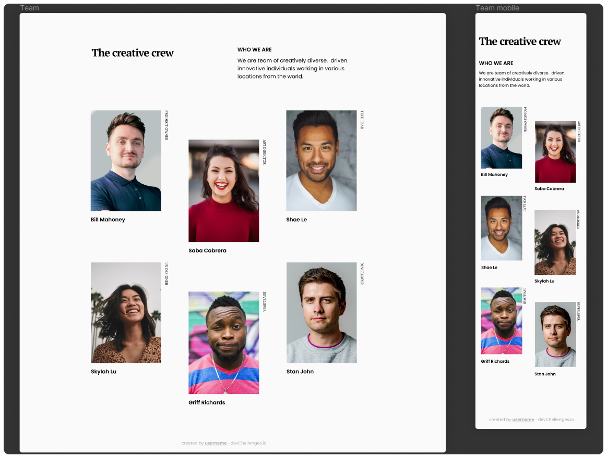

<h1 align="center">My team page</h1>

   Solution for a challenge from  <a href="http://devchallenges.io" target="_blank">Devchallenges.io</a>.

  <h3>
    <a href="https://linelinlove.github.io/devchallenges.io/responsive-web-developer/2-my-team-page/my-team-page.html">
      Demo
    </a>
     | 
    <a href="https://devchallenges.io/solutions/HIUIhSG8ez3QLs9XFESh">
      Solution
    </a>
     | 
    <a href="https://devchallenges.io/challenges/hhmesazsqgKXrTkYkt0U">
      Challenge
    </a>
  </h3>

## Table of Contents

- [Overview](#overview)
  - [Built With](#built-with)
- [Features](#features)
- [Contact](#contact)

## Overview

- You can see the [live demo here](https://linelinlove.github.io/devchallenges.io/responsive-web-developer/2-my-team-page/my-team-page.html).

### Built With

- [HTML](https://www.w3schools.com/html/)
- [CSS](https://www.w3schools.com/css/)
- [Tailwind](https://tailwindcss.com/)

## Features

This application/site was created as a submission to a [DevChallenges](https://devchallenges.io/challenges) challenge. The [challenge](https://devchallenges.io/challenges/hhmesazsqgKXrTkYkt0U) was to build an application to complete the given user stories.

## Contact

- GitHub [@LinelinLove](https://github.com/LinelinLove)