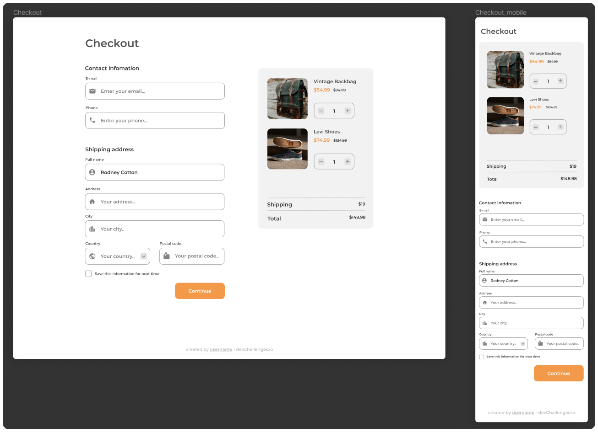

<!-- Please update value in the {}  -->

<h1 align="center">Checkout Page</h1>

   Solution for a challenge from  <a href="http://devchallenges.io" target="_blank">Devchallenges.io</a>.

  <h3>
    <a href="https://linelinlove.github.io/devchallenges.io/responsive-web-developer/6-checkout-page/checkout-page.html">
      Demo
    </a>
     | 
    <a href="https://devchallenges.io/solutions/dMcZWrZUkH7XNvpDHCcY">
      Solution
    </a>
     | 
    <a href="https://devchallenges.io/challenges/0J1NxxGhOUYVqihwegfO">
      Challenge
    </a>
  </h3>

## Table of Contents

- [Overview](#overview)
  - [Built With](#built-with)
- [Features](#features)
- [Contact](#contact)

## Overview

- You can see the [live demo here](https://linelinlove.github.io/devchallenges.io/responsive-web-developer/6-checkout-page/checkout-page.html).

### Built With

- [HTML](https://www.w3schools.com/html/)
- [Tailwind](https://tailwindcss.com/)
- [JS](https://www.w3schools.com/js/)

## Features

This application/site was created as a submission to a [DevChallenges](https://devchallenges.io/challenges) challenge. The [challenge](https://devchallenges.io/challenges/0J1NxxGhOUYVqihwegfO) was to build an application to complete the given user stories.

## Contact

- GitHub [@LinelinLove](https://github.com/LinelinLove)